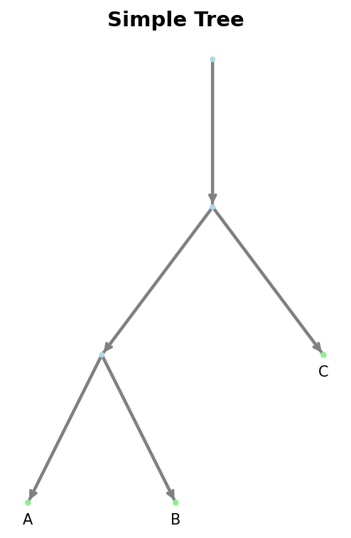

Directed Networks (Basic)
==========================

This page covers basic operations for working with **DirectedPhyNetwork**. For advanced 
features like network analysis, transformations, and classifications, see 
:doc:`Directed Networks (Advanced) <advanced>`.

DirectedPhyNetwork
------------------

**DirectedPhyNetwork** represents fully directed phylogenetic networks with a single root 
node. All edges are directed, explicitly representing the direction of evolutionary time. 
Hybrid nodes have in-degree >= 2 and out-degree 1.

**I/O Formats**: eNewick (default, extensions: ``.enewick``, ``.eNewick``, ``.enwk``, ``.nwk``, ``.newick``), 
DOT (extensions: ``.dot``, ``.gv``). See :doc:`I/O <../../../../io>` for details.

   
   Example of a simple directed tree.

.. figure:: ../../../../_static/images/example_hybrid_directed.png
   :alt: Example directed network with hybrid
   :width: 400px
   :align: center
   
   Example of a directed network with a hybrid node.

Creating Networks
-----------------

Create networks from edges and nodes:

.. code-block:: python

   from phylozoo import DirectedPhyNetwork
   
   # Simple tree
   network = DirectedPhyNetwork(
       edges=[("root", "A"), ("root", "B"), ("root", "C")],
       nodes=[
           ("A", {"label": "A"}),
           ("B", {"label": "B"}),
           ("C", {"label": "C"})
       ]
   )

Create networks with hybrid nodes:

.. code-block:: python

   # Network with hybridization
   hybrid_net = DirectedPhyNetwork(
       edges=[
           ("root", "u1"), ("root", "u2"),
           ("u1", "h", {"gamma": 0.6}),
           ("u2", "h", {"gamma": 0.4}),  # Must sum to 1.0
           ("h", "leaf1")
       ],
       nodes=[("leaf1", {"label": "A"})]
   )

Loading and Saving
------------------

Networks can be loaded from and saved to files:

.. code-block:: python

   # Save network
   network.save("network.enewick")
   
   # Load network
   network = DirectedPhyNetwork.load("network.enewick")

See the :doc:`I/O <../../../../io>` page for supported formats and detailed I/O operations.

Basic Properties
-----------------

Access basic network properties:

.. code-block:: python

   # Node and edge counts
   num_nodes = network.num_nodes
   num_edges = network.num_edges
   
   # Network structure
   root = network.root_node
   leaves = network.leaves  # Set of leaf node IDs
   taxa = network.taxa       # Set of taxon labels (strings)
   internal_nodes = network.internal_nodes
   
   # Node types
   hybrid_nodes = network.hybrid_nodes
   tree_nodes = network.tree_nodes
   
   # Check if tree
   is_tree = network.is_tree()

Accessing Edge Attributes
-------------------------

Networks support edge attributes like branch lengths, bootstrap values, and gamma 
probabilities:

.. code-block:: python

   # Get branch length
   bl = network.get_branch_length("root", "A")
   
   # Get bootstrap support
   bs = network.get_bootstrap("root", "A")
   
   # Get gamma (for hybrid edges)
   gamma = network.get_gamma("u1", "h")

Simple Transformations
----------------------

Basic network transformations:

.. code-block:: python

   from phylozoo.core.dnetwork.transformations import suppress_2_blobs
   
   # Suppress degree-2 nodes (simplify network)
   simplified = suppress_2_blobs(network)

For more advanced transformations, see :doc:`Directed Networks (Advanced) <advanced>`.

API Reference
-------------

**Class**: :class:`phylozoo.core.network.dnetwork.DirectedPhyNetwork`

**Basic Properties:**

* **num_nodes** - Number of nodes in the network
* **num_edges** - Number of edges in the network
* **root_node** - The root node identifier
* **leaves** - Set of leaf node IDs
* **taxa** - Set of taxon labels (strings)
* **internal_nodes** - Set of internal node IDs
* **hybrid_nodes** - Set of hybrid node IDs
* **tree_nodes** - Set of tree node IDs

**Basic Methods:**

* **is_tree()** - Check if network is a tree
* **get_branch_length(u, v)** - Get branch length for edge
* **get_bootstrap(u, v)** - Get bootstrap value for edge
* **get_gamma(u, v)** - Get gamma probability for hybrid edge
* **save(filename)** - Save network to file
* **load(filename)** - Load network from file (class method)

**Basic Transformations:**

* **suppress_2_blobs(network)** - Suppress degree-2 nodes in 2-blobs. Simplifies network 
  structure by removing unnecessary degree-2 nodes while preserving topology. See 
  :func:`phylozoo.core.network.dnetwork.transformations.suppress_2_blobs` for details.

.. note::
   For advanced network features like LSA nodes, blobs, network classifications, 
   binary resolution, and isomorphism checking, see :doc:`Directed Networks (Advanced) <advanced>`.

.. tip::
   All networks are immutable. To modify a network, create a new instance with the 
   desired changes.

.. seealso::
   For semi-directed networks, see :doc:`Semi-Directed Networks <../semi_directed/overview>`. 
   For I/O operations, see :doc:`I/O <../../../../io>`.
