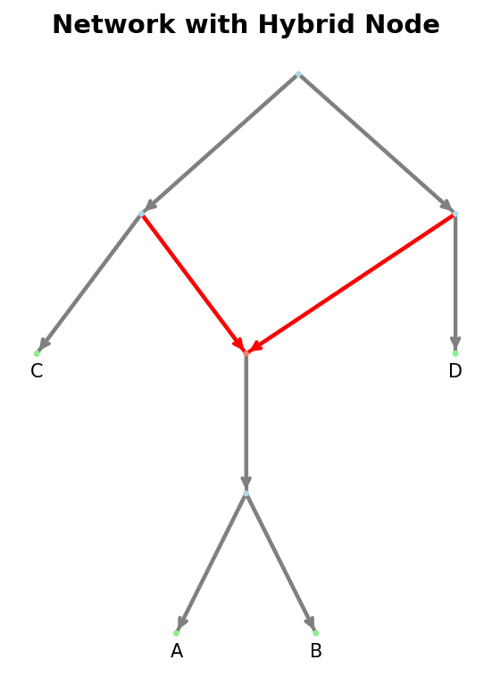

Directed Network (Class)
=========================

The :mod:`phylozoo.core.network.dnetwork` module defines the
:class:`~phylozoo.core.network.dnetwork.base.DirectedPhyNetwork` class, the central representation of rooted, directed
phylogenetic networks in PhyloZoo.

A directed phylogenetic network is a graph with a distinguished root and leaves representing taxa. The
directed edges encode ancestor–descendant relationships, with nodes of higher
in-degree represent reticulate evolutionary events such as hybridization,
recombination, or horizontal gene transfer.

All classes and functions on this page can be imported from the core network module:

.. code-block:: python

   from phylozoo import DirectedPhyNetwork
   # or directly
   from phylozoo.core.network.dnetwork import DirectedPhyNetwork

What is a directed phylogenetic network?
----------------------------------------

Mathematically, a directed phylogenetic network is a weakly connected, directed
acyclic multigraph (i.e. allowing parallel edges) with the following nodes:

- **Root**: exactly one node with in-degree 0
- **Leaves**: nodes with out-degree 0 and in-degree 1, each corresponding to a taxon
- **Tree nodes**: internal nodes with in-degree 1 and out-degree ≥ 2
- **Hybrid nodes**: internal nodes with in-degree ≥ 2 and out-degree 1

Internal nodes may be unlabeled. Leaf nodes carry labels (taxa), either provided
explicitly or generated automatically. For technical completeness, the empty network
and the single-node network (where root and leaf coincide) are also considered valid.

**Example Networks**

A simple directed tree, in which all internal nodes are tree nodes:

.. code-block:: text

              ┌─A
          ┌───┤
          │   └─B
      ────┤
          │   ┌─C
          └───┤
              └─D

A directed network containing a hybrid node with two incoming edges:

.. code-block:: text

              ┌────A
          ┌───┤
          │   └──┬─B
          |      │
      ────┤      ├─C
          |      │
          │   ┌──┴─D
          └───┤
              └────E

Creating a DirectedPhyNetwork
------------------------------

A :class:`~phylozoo.core.network.dnetwork.base.DirectedPhyNetwork` is defined by its graph structure and optional attributes.
There are three main ways to construct such a network.

From edge and node specifications
^^^^^^^^^^^^^^^^^^^^^^^^^^^^^^^^^^

Edges may be given as tuples or dictionaries; nodes can explicitly be specified via
(node_id, attributes) pairs, but are also automatically generated from the edges if not provided.

.. code-block:: python

   from phylozoo import DirectedPhyNetwork

   network = DirectedPhyNetwork(
       edges=[("root", "A"), ("root", "B"), ("root", "C")],
   )
   # or
   network = DirectedPhyNetwork(
       edges=[("root", "A"), ("root", "B"), ("root", "C")],
       nodes=[("A", {"label": "A"}), ("B", {"label": "B"}), ("C", {"label": "C"})]
   )

From an existing graph
^^^^^^^^^^^^^^^^^^^^^^

Directed networks can also be constructed from existing graph objects using the
:func:`~phylozoo.core.network.dnetwork.conversions.dnetwork_from_graph` function. This is particularly useful when implementing algorithms that
operate on mutable graph representations.

.. code-block:: python

   from phylozoo.core.network.dnetwork.conversions import dnetwork_from_graph
   import networkx as nx

   G = nx.MultiDiGraph()
   G.add_edge("root", "A")

   network = dnetwork_from_graph(G)

.. tip::
   The ``dnetwork_from_graph`` function is especially useful when writing your own algorithms.
   It allows you to work directly with the underlying NetworkX or PhyloZoo graph object
   of a DirectedPhyNetwork, after which you can convert back to a DirectedPhyNetwork at the
   end of the algorithm.

   .. code-block:: python

      # Example of writing an algorithm that works with the underlying graph
      def my_algorithm(network: DirectedPhyNetwork):
          # Get the underlying PhyloZoo DirectedMultiGraph
          phylzoo_dm_graph = network._graph
          # Get the underlying NetworkX MultiDiGraph
          nx_graph = phylzoo_dm_graph._graph
          # Do something with the NetworkX graph or the PhyloZoo DirectedMultiGraph
          ...
          # Convert back to a DirectedPhyNetwork
          return dnetwork_from_graph(nx_graph)

File Input/Output
^^^^^^^^^^^^^^^^^

:class:`~phylozoo.core.network.dnetwork.base.DirectedPhyNetwork` supports reading and writing in standard formats:

- **eNewick** (default): Extended Newick for rooted networks with hybrid nodes and edge attributes — see :doc:`eNewick <../../../utils/io/formats/enewick>`
- **DOT**: GraphViz format for visualization and storage — see :doc:`DOT format <../../../utils/io/formats/dot>`

.. code-block:: python

   # Load from file (auto-detects format by extension)
   network = DirectedPhyNetwork.load("network.enewick")

   # Load with explicit format
   network = DirectedPhyNetwork.load("network.dot", format="dot")

   # Load from string
   network = DirectedPhyNetwork.from_string("(A,B);", format="enewick")

   # Save to file
   network.save("output.enewick")
   network.save("output.dot", format="dot")

.. seealso::
   The :class:`~phylozoo.core.network.dnetwork.base.DirectedPhyNetwork` class uses the
   :class:`~phylozoo.utils.io.mixin.IOMixin` interface, providing consistent file handling across PhyloZoo
   classes. For details on the I/O system, see the :doc:`I/O manual <../../../utils/io/overview>`.

Validation on Construction
^^^^^^^^^^^^^^^^^^^^^^^^^^

Every :class:`~phylozoo.core.network.dnetwork.base.DirectedPhyNetwork` is validated at construction time using the :meth:`~phylozoo.core.network.dnetwork.base.DirectedPhyNetwork.validate` method. Validation
guarantees that the object represents a well-defined phylogenetic network:

- the graph is acyclic and weakly connected,
- there is exactly one root,
- node degrees match the root / leaf / tree / hybrid definitions,
- special attributes lie in their permitted ranges (see below for more details),
- taxon labels are unique.

By default, invalid networks cannot be constructed. Validation can be disabled for
performance-critical operations or when working with intermediate network states that
may temporarily violate validation rules. 
See the :doc:`Validation documentation <../../../utils/validation>`
for details on how to disable validation.

Attributes
----------

Nodes, edges, and the network itself may carry arbitrary attributes. Most attributes are stored without
interpretation; however, the following attributes have a special, validated semantic role in directed
phylogenetic networks.

Setting Attributes
^^^^^^^^^^^^^^^^^^^^^^^^^^^^^^^^^^^^^^^^

Attributes are set when creating a network by providing them in the edge, node, or attributes
specifications:

**Edge Attributes**

Edge attributes are specified in edge dictionaries:

.. code-block:: python

   network = DirectedPhyNetwork(
       edges=[
           {"u": "root", "v": "A", "branch_length": 0.5, "bootstrap": 0.95},
           {"u": "root", "v": "B", "branch_length": 0.3}
       ],
       nodes=[("A", {"label": "A"}), ("B", {"label": "B"})]
   )

**Node Attributes**

Node attributes are specified in node tuples:

.. code-block:: python

   network = DirectedPhyNetwork(
       edges=[("root", "A"), ("root", "B")],
       nodes=[
           ("A", {"label": "A", "custom_attr": "value1"}),
           ("B", {"label": "B", "custom_attr": "value2"})
       ]
   )

**Network Attributes**

Network-level attributes are specified via the `attributes` parameter:

.. code-block:: python

   network = DirectedPhyNetwork(
       edges=[("root", "A")],
       nodes=[("A", {"label": "A"})],
       attributes={"source": "simulation", "version": "1.0"}
   )

Special edge attributes
^^^^^^^^^^^^^^^^^^^^^^^

There are three special edge attributes that have a special, validated semantic role in directed
phylogenetic networks and which may be used by certain algorithms.

**branch_length** (float)

Represents evolutionary distance along an edge.

**bootstrap** (float in [0, 1])

A statistical support value associated with the edge, for example from bootstrap or
posterior analyses.

**gamma** (float in [0, 1])

The inheritance probability for hybrid edges (edges entering a hybrid node). For each
hybrid node, the incoming gamma values must sum to 1.0.

These attributes can be accessed via dedicated methods:

.. code-block:: python

   network.get_branch_length("root", "A")
   network.get_bootstrap("root", "A")
   network.get_gamma("u1", "h")

Special node attribute
^^^^^^^^^^^^^^^^^^^^^^

There is one special node attribute that has a special, validated semantic role in directed
phylogenetic networks and which may be used by certain algorithms.

**label** (string)

A unique identifier for a node. Labels must be unique across all nodes and must be strings.
Leaf nodes always have labels (these are referred to as taxa), but internal nodes may be
unlabeled. If a leaf node is created without an explicit label, one is automatically generated
from the node ID.

Labels can be accessed via dedicated methods:

.. code-block:: python

   # Get label from node ID
   label = network.get_label(node_id)  # Returns label string or None
   
   # Get node ID from label
   node_id = network.get_node_id("A")  # Returns node ID or None

Additional attributes
^^^^^^^^^^^^^^^^^^^^^

Any additional node or edge attributes may be attached freely. Attributes without a
special semantic role are preserved by the network object and by I/O operations but are
not interpreted or validated. You can access these using generic attribute access methods:

.. code-block:: python

   # Get node attribute
   node_attr = network.get_node_attribute(node_id, "custom_attr")
   
   # Get edge attribute
   edge_attr = network.get_edge_attribute(u, v, key=0, attr="custom_attr")
   
   # Get network-level attribute
   net_attr = network.get_network_attribute("source")

Accessing Network Properties
-----------------------------

The :class:`~phylozoo.core.network.dnetwork.base.DirectedPhyNetwork` class provides read-only access to fundamental structural
properties. These properties are computed from the validated network structure and cannot be
modified directly. All properties are cached for efficient repeated access.

Basic Properties
^^^^^^^^^^^^^^^^

Basic properties provide fundamental information about the network size and structure.

**Nodes**

The :attr:`~phylozoo.core.network.dnetwork.base.DirectedPhyNetwork.nodes` cached property exposes a view of all node IDs (same interface as the
underlying graph). Use ``network.nodes()`` to iterate, or ``network.nodes(data=True)`` for
attributes.

.. code-block:: python

   # Get nodes (cached view)
   list(network.nodes)   # or network.nodes()
   list(network.nodes(data=True))  # with attributes

**Edges**

The :attr:`~phylozoo.core.network.dnetwork.base.DirectedPhyNetwork.edges` cached property exposes a view of all directed edges (same interface as the
underlying graph). Use ``network.edges()``, ``network.edges(keys=True)``, or
``network.edges(keys=True, data=True)``.

.. code-block:: python

   # Get edges (cached view)
   list(network.edges)   # or network.edges(keys=True)
   list(network.edges(keys=True, data=True))  # with keys and attributes
   
**Node and Edge Counts**

The :meth:`~phylozoo.core.network.dnetwork.base.DirectedPhyNetwork.number_of_nodes` and :meth:`~phylozoo.core.network.dnetwork.base.DirectedPhyNetwork.number_of_edges` methods return the total count of
nodes and edges in the network, respectively.

.. code-block:: python

   # Get counts
   num_nodes = network.number_of_nodes()  # Total number of nodes
   num_edges = network.number_of_edges()  # Total number of edges

**Check if Edge Exists**

The :meth:`~phylozoo.core.network.dnetwork.base.DirectedPhyNetwork.has_edge` method checks if an edge exists between two nodes.

.. code-block:: python

   # Check if edge exists between nodes u and v
   has_edge = network.has_edge(u, v)  # Returns True if edge exists, False otherwise
   
   # Check if edge exists with a specific key
   has_edge_with_key = network.has_edge(u, v, key=0)  # Returns True if edge exists with key 0, False otherwise

Node Types
^^^^^^^^^^

Network structure properties identify key nodes and their roles in the network topology.

**Root**

The :attr:`~phylozoo.core.network.dnetwork.base.DirectedPhyNetwork.root_node` property returns the unique root node (in-degree 0).

.. code-block:: python

   # Get root node
   root = network.root_node  # Returns the root node ID

**Leaves and Taxa**

The :attr:`~phylozoo.core.network.dnetwork.base.DirectedPhyNetwork.leaves` property returns a set of all leaf node IDs (out-degree 0).
The :attr:`~phylozoo.core.network.dnetwork.base.DirectedPhyNetwork.taxa` property returns a set of all taxon labels (strings associated with leaves).

.. code-block:: python

   # Get leaves
   leaves = network.leaves  # Set of leaf node IDs
   # Get taxa
   taxa = network.taxa  # Set of taxon labels

**Internal Nodes**

The :attr:`~phylozoo.core.network.dnetwork.base.DirectedPhyNetwork.internal_nodes` property returns a set of all internal (non-leaf) node IDs.

.. code-block:: python

   # Get internal nodes
   internal = network.internal_nodes  # Set of internal node IDs

**Tree and Hybrid Nodes**

The :attr:`~phylozoo.core.network.dnetwork.base.DirectedPhyNetwork.tree_nodes` property returns a set of all tree node IDs (internal nodes with in-degree 1 and out-degree ≥ 2).
The :attr:`~phylozoo.core.network.dnetwork.base.DirectedPhyNetwork.hybrid_nodes` property returns a set of all hybrid node IDs (internal nodes with in-degree ≥ 2 and out-degree 1).

.. code-block:: python

   # Get tree nodes
   tree = network.tree_nodes  # Set of tree node IDs
   # Get hybrid nodes
   hybrid = network.hybrid_nodes  # Set of hybrid node IDs

Edge Types
^^^^^^^^^^

Edge type properties classify edges according to their role in the network structure.

**Tree and Hybrid Edges**

The :attr:`~phylozoo.core.network.dnetwork.base.DirectedPhyNetwork.tree_edges` property returns all tree edges (edges that are not hybrid edges)
as a set of (u, v, key) tuples. The :attr:`~phylozoo.core.network.dnetwork.base.DirectedPhyNetwork.hybrid_edges` property returns all hybrid edges
(edges entering hybrid nodes) as a set of (u, v, key) tuples.

.. code-block:: python

   # Get edge type sets
   tree_edges = network.tree_edges    # Set of (u, v, key) tuples for tree edges
   hybrid_edges = network.hybrid_edges  # Set of (u, v, key) tuples for hybrid edges
   
   # Example: iterate over hybrid edges
   for u, v, key in network.hybrid_edges:
       gamma = network.get_gamma(u, v, key=key)
       print(f"Edge ({u}, {v}, {key}) has gamma={gamma}")

Node Connectivity
^^^^^^^^^^^^^^^^^

Connectivity properties provide information about how nodes are connected in the network.

**Node Degrees**

The :meth:`~phylozoo.core.network.dnetwork.base.DirectedPhyNetwork.degree`, :meth:`~phylozoo.core.network.dnetwork.base.DirectedPhyNetwork.indegree`, and :meth:`~phylozoo.core.network.dnetwork.base.DirectedPhyNetwork.outdegree` methods return the total degree,
in-degree, and out-degree of a node, respectively.

.. code-block:: python

   # Get node degrees
   total_degree = network.degree(v)      # Total degree (in + out)
   in_degree = network.indegree(v)       # Number of incoming edges
   out_degree = network.outdegree(v)     # Number of outgoing edges

**Neighbors**

The :meth:`~phylozoo.core.network.dnetwork.base.DirectedPhyNetwork.parents`, :meth:`~phylozoo.core.network.dnetwork.base.DirectedPhyNetwork.children`, and :meth:`~phylozoo.core.network.dnetwork.base.DirectedPhyNetwork.neighbors` methods return iterators over
parent nodes, child nodes, and all adjacent nodes, respectively.

.. code-block:: python

   # Get parent nodes (nodes with edges pointing to v)
   parents = list(network.parents(v))  # List of parent node IDs
   
   # Get child nodes (nodes with edges from v)
   children = list(network.children(v))  # List of child node IDs
   
   # Get all neighbors (parents and children)
   neighbors = list(network.neighbors(v))  # List of all adjacent node IDs
   
   # Example: iterate over children
   for child in network.children(v):
       print(f"Node {v} has child {child}")

**Incident Edges**

The :meth:`~phylozoo.core.network.dnetwork.base.DirectedPhyNetwork.incident_parent_edges` and :meth:`~phylozoo.core.network.dnetwork.base.DirectedPhyNetwork.incident_child_edges` methods return iterators
over edges entering and leaving a node, respectively. These methods can optionally include
edge keys and attribute data.

.. code-block:: python

   # Get incoming edges (from parents)
   incoming = list(network.incident_parent_edges(v))
   # Returns: [(u1, v), (u2, v), ...]
   
   # Get incoming edges with keys
   incoming_with_keys = list(network.incident_parent_edges(v, keys=True))
   # Returns: [(u1, v, key1), (u2, v, key2), ...]
   
   # Get incoming edges with data
   incoming_with_data = list(network.incident_parent_edges(v, data=True))
   # Returns: [(u1, v, {'branch_length': 0.5, ...}), ...]
   
   # Get outgoing edges (to children)
   outgoing = list(network.incident_child_edges(v))
   # Returns: [(v, w1), (v, w2), ...]
   
   # Example: get all edge attributes for incoming edges
   for u, v, key, data in network.incident_parent_edges(v, keys=True, data=True):
       branch_length = data.get('branch_length')
       bootstrap = data.get('bootstrap')
       print(f"Edge ({u}, {v}, {key}): bl={branch_length}, bs={bootstrap}")

Copying
^^^^^^^^^^^^^^^^^^

The :meth:`~phylozoo.core.network.dnetwork.base.DirectedPhyNetwork.copy` method creates a shallow copy of the network. The copy shares the same
underlying graph structure but is a separate instance.

.. code-block:: python

   # Create a copy
   network_copy = network.copy()
   
   # Copies are independent instances
   assert network_copy is not network
   assert network_copy.root_node == network.root_node

.. seealso::
   Some less commonly used or computationally expensive properties are available as functions
   in the advanced features module. These include blobs, omnian nodes, cut edges/vertices,
   and various network classifications. See :doc:`Directed Network (Advanced) <directed_network_algorithms>`
   for details.

Visualization
-------------

DirectedPhyNetwork can be visualized using the PhyloZoo visualization module. The
visualization system supports multiple layout algorithms and styling options.

   
   Example visualization of a directed network with a hybrid node.

.. code-block:: python

   from phylozoo.viz import plot
   
   # Plot network with default rectangular layout
   plot(network)

For more visualization options, including different layout types,
styling, and customization, see the :doc:`Visualization documentation <../../../visualization/overview>`.

See Also
--------

- :doc:`API Reference <../../../../api/core/network/index>` - Complete function signatures and detailed examples
- :doc:`Directed Network (Advanced) <directed_network_algorithms>` - Advanced features, transformations, and classifications
- :doc:`Directed Generator <directed_generator>` - Level-k network generators
- :doc:`Semi-Directed Networks <../semi_directed/overview>` - Semi-directed network representations
- :doc:`I/O <../../../utils/io/index>` - File I/O operations and formats
- :doc:`Validation <../../../utils/validation>` - Validation system and disabling validation
- :doc:`Visualization <../../../visualization/overview>` - Network visualization and plotting
