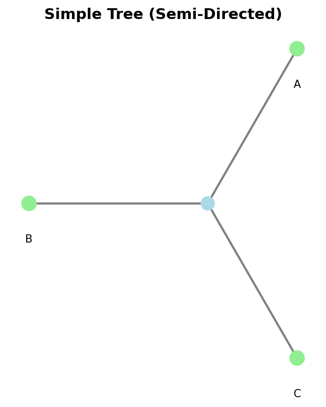

Semi-Directed Networks (Basic)
================================

The :mod:`phylozoo.core.network.sdnetwork` module provides the :class:`SemiDirectedPhyNetwork` class,
which represents networks with directed hybrid edges and undirected tree edges. SemiDirectedPhyNetwork
allows for more flexible representation of phylogenetic networks without requiring a fixed root,
making it useful for unrooted analyses. Semi-directed networks cannot have undirected cycles.
For advanced features like network analysis, transformations, and classifications, see
:doc:`Semi-Directed Networks (Advanced) <advanced>`.

All classes and functions on this page can be imported from the core network module:

.. code-block:: python

   from phylozoo import SemiDirectedPhyNetwork
   # or directly
   from phylozoo.core.network.sdnetwork import SemiDirectedPhyNetwork

Working with SemiDirectedPhyNetwork
-------------------------------------

The :class:`phylozoo.core.network.sdnetwork.SemiDirectedPhyNetwork` class is the canonical container
for semi-directed phylogenetic networks in PhyloZoo. It provides an immutable representation
that ensures data integrity throughout your analysis pipeline.

.. note::
   :class: dropdown

   **Implementation details**

   SemiDirectedPhyNetwork is designed for immutability and flexibility:

   - Networks are immutable after construction
   - Supports both directed (hybrid) and undirected (tree) edges
   - No fixed root allows for flexible rooting analysis
   - Hybrid nodes are validated to have proper in-degree
   - Edge attributes (branch lengths, bootstrap, gamma) are stored efficiently
   - The network structure is validated at construction time

   For implementation details, see :mod:`src/phylozoo/core/network/sdnetwork/base.py`.

   
   Example of a simple semi-directed tree.

.. figure:: ../../../../_static/images/example_hybrid_semidirected.png
   :alt: Example semi-directed network with hybrid
   :width: 400px
   :align: center
   
   Example of a semi-directed network with a hybrid node.

Creating a SemiDirectedPhyNetwork
^^^^^^^^^^^^^^^^^^^^^^^^^^^^^^^^^

SemiDirectedPhyNetwork objects can be created from both directed and undirected edges.
Directed edges represent hybrid relationships (reticulations), while undirected edges
represent tree-like relationships. This mixed structure allows for flexible representation
of phylogenetic networks without requiring a fixed root.

.. code-block:: python

   from phylozoo import SemiDirectedPhyNetwork
   
   # Simple tree (all edges undirected)
   network = SemiDirectedPhyNetwork(
       undirected_edges=[(3, 1), (3, 2), (3, 4)],
       nodes=[
           (1, {"label": "A"}),
           (2, {"label": "B"}),
           (4, {"label": "C"})
       ]
   )

Networks with hybrid nodes use directed edges to represent the reticulation events.
Each hybrid node must have at least two incoming directed edges, each with a gamma
probability that sums to 1.0. The undirected edges represent the tree structure below
and around the hybrid nodes.

.. code-block:: python

   # Network with hybridization
   hybrid_net = SemiDirectedPhyNetwork(
       directed_edges=[
           (5, 4, {"gamma": 0.6}),  # Hybrid edge
           (6, 4, {"gamma": 0.4})   # Hybrid edge (must sum to 1.0)
       ],
       undirected_edges=[(4, 1), (4, 2), (4, 3)],  # Tree edges
       nodes=[
           (1, {"label": "A"}),
           (2, {"label": "B"}),
           (3, {"label": "C"})
       ]
   )

Accessing Network Properties
^^^^^^^^^^^^^^^^^^^^^^^^^^^^^

SemiDirectedPhyNetwork provides properties to access fundamental network structure information,
including node and edge counts, leaf and taxon identification, and node type classification.
Unlike directed networks, semi-directed networks do not have a fixed root, but root locations
can be identified.

.. code-block:: python

   # Node and edge counts
   num_nodes = network.num_nodes
   num_edges = network.num_edges
   
   # Network structure
   leaves = network.leaves  # Set of leaf node IDs
   taxa = network.taxa       # Set of taxon labels (strings)
   internal_nodes = network.internal_nodes
   
   # Node types
   hybrid_nodes = network.hybrid_nodes
   tree_nodes = network.tree_nodes
   
   # Check if tree
   is_tree = network.is_tree()
   
   # Get root locations (where network can be rooted)
   from phylozoo.core.sdnetwork import features
   root_locs = features.root_locations(network)

Accessing Edge Attributes
^^^^^^^^^^^^^^^^^^^^^^^^^

Edge attributes such as branch lengths, bootstrap support values, and gamma probabilities
can be accessed using dedicated methods. Branch lengths and bootstrap values work for both
directed and undirected edges, while gamma probabilities are only applicable to directed
hybrid edges.

.. code-block:: python

   # Get branch length (works for both directed and undirected edges)
   bl = network.get_branch_length(3, 1)
   
   # Get bootstrap support
   bs = network.get_bootstrap(3, 1)
   
   # Get gamma (for hybrid edges only)
   gamma = network.get_gamma(5, 4)

File Input/Output
^^^^^^^^^^^^^^^^^

SemiDirectedPhyNetwork supports loading from and saving to files in multiple formats. The
default format is Newick, which can represent semi-directed networks. The PhyloZoo-DOT
format provides additional flexibility for complex network structures.

**Supported Formats:**

- **Newick** (default): Standard Newick format. Extensions: ``.nwk``, ``.newick``, ``.enewick``, ``.eNewick``, ``.enw``
- **PhyloZoo-DOT**: Custom DOT format. Extension: ``.pzdot``

.. code-block:: python

   # Save network
   network.save("network.newick")
   
   # Load network
   network = SemiDirectedPhyNetwork.load("network.newick")

.. seealso::
   The I/O system uses the :class:`phylozoo.utils.io.IOMixin` interface, providing
   consistent file handling across PhyloZoo classes. For details on the I/O system,
   see the :doc:`I/O documentation <../../../../io>`. For specific information about
   supported file formats and parameter options for networks, see the
   :mod:`API reference <phylozoo.core.network.sdnetwork.io>`.

Basic Transformations
---------------------

Basic transformation functions allow you to simplify network structures while preserving
topological information.

**Suppressing 2-Blobs**

The :func:`phylozoo.core.sdnetwork.transformations.suppress_2_blobs` function removes
degree-2 nodes within 2-blobs (biconnected components with 2 incident edges), simplifying
the network without changing its essential structure.

.. code-block:: python

   from phylozoo.core.sdnetwork import transformations
   
   # Suppress degree-2 nodes (simplify network)
   simplified = transformations.suppress_2_blobs(network)

For more advanced transformations, see :doc:`Semi-Directed Networks (Advanced) <advanced>`.

.. note::
   For advanced network features like blobs, network classifications, and root locations, 
   see :doc:`Semi-Directed Networks (Advanced) <advanced>`.

.. tip::
   All networks are immutable. To modify a network, create a new instance with the 
   desired changes.

See Also
--------

- :doc:`Semi-Directed Networks (Advanced) <advanced>` - Advanced features, transformations, and classifications
- :doc:`Directed Networks <../directed/overview>` - Fully directed network representations
- :doc:`I/O <../../../../io>` - File I/O operations and formats
