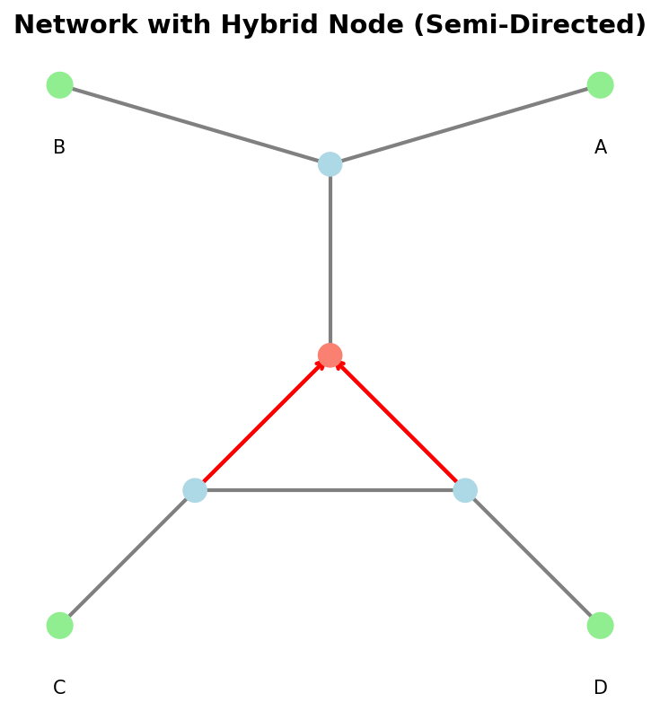

Semi-Directed Network (Class)
==============================

The :mod:`phylozoo.core.network.sdnetwork` module defines the
:class:`~phylozoo.core.network.sdnetwork.sd_phynetwork.SemiDirectedPhyNetwork` class, the central representation of semi-directed
phylogenetic networks in PhyloZoo.

A semi-directed phylogenetic network is a graph with directed hybrid edges and undirected tree edges,
allowing for representing phylogenetic networks with unknown root locations.

All classes and functions on this page can be imported from the core network module:

.. code-block:: python

   from phylozoo import SemiDirectedPhyNetwork
   # or directly
   from phylozoo.core.network.sdnetwork import SemiDirectedPhyNetwork

What is a semi-directed phylogenetic network?
---------------------------------------------

Mathematically, a semi-directed phylogenetic network is a weakly connected, mixed multigraph
(with both directed and undirected edges, as well as parallel edges) that can be obtained from a directed phylogenetic network 
(see :doc:`Directed Networks <../directed/directed_network_class>`) by undirecting all non-hybrid edges and suppressing the root node.
It commonly used to represent uncertainty of the root placement in a directed network.

Creating a SemiDirectedPhyNetwork
----------------------------------

A :class:`~phylozoo.core.network.sdnetwork.sd_phynetwork.SemiDirectedPhyNetwork` is defined by its graph structure and optional attributes.
There are three ways to construct such a network.

From edge and node specifications
^^^^^^^^^^^^^^^^^^^^^^^^^^^^^^^^^

Edges may be given as tuples or dictionaries; nodes can explicitly be specified via
(node_id, attributes) pairs, but are also automatically generated from the edges if not provided.
Directed edges represent hybrid relationships, while undirected edges represent tree-like relationships.

.. code-block:: python

   from phylozoo import SemiDirectedPhyNetwork

   # Simple tree (all edges undirected)
   network = SemiDirectedPhyNetwork(
       undirected_edges=[(3, 1), (3, 2), (3, 4)],
   )
   # or
   network = SemiDirectedPhyNetwork(
       undirected_edges=[(3, 1), (3, 2), (3, 4)],
       nodes=[(1, {"label": "A"}), (2, {"label": "B"}), (4, {"label": "C"})]
   )

Hybrid nodes are created by assigning multiple incoming directed edges to the same node.

.. code-block:: python

   # Network with hybridization
   hybrid_net = SemiDirectedPhyNetwork(
       directed_edges=[
           (2, 4),  # Hybrid edge
           (3, 4)   # Hybrid edge (must sum to 1.0)
       ],
       undirected_edges=[(1, 2), (1, 3), (4, 5), (2, 6), (3, 7)],  # Tree edges
       nodes=[(5, {"label": "A"}), (6, {"label": "B"}), (7, {"label": "C"})]
   )

From an existing graph
^^^^^^^^^^^^^^^^^^^^^^

Semi-directed networks can also be constructed from existing graph objects using the
:func:`~phylozoo.core.network.sdnetwork.conversions.sdnetwork_from_graph` function.

.. code-block:: python

   from phylozoo.core.network.sdnetwork.conversions import sdnetwork_from_graph
   import networkx as nx

   G = nx.Graph()
   G.add_edge(1, 2)

   network = sdnetwork_from_graph(G, network_type='semi-directed')

.. tip::
   The ``sdnetwork_from_graph`` function is especially useful when writing your own algorithms.
   It allows you to work directly with the underlying NetworkX or PhyloZoo graph object
   of a SemiDirectedPhyNetwork, after which you can convert back to a SemiDirectedPhyNetwork at the
   end of the algorithm.

   .. code-block:: python

      # Example of writing an algorithm that works with the underlying graph
      def my_algorithm(network: SemiDirectedPhyNetwork):
          # Get the underlying PhyloZoo MixedMultiGraph
          phylzoo_mm_graph = network._graph
          # Get the underlying NetworkX graphs
          nx_directed = phylzoo_mm_graph._directed
          nx_undirected = phylzoo_mm_graph._undirected
          # Do something with the NetworkX graphs or the PhyloZoo MixedMultiGraph
          ...
          # Convert back to a SemiDirectedPhyNetwork
          return sdnetwork_from_graph(phylzoo_mm_graph, network_type='semi-directed')

File Input/Output
^^^^^^^^^^^^^^^^^

:class:`~phylozoo.core.network.sdnetwork.sd_phynetwork.SemiDirectedPhyNetwork` supports reading and writing in standard formats:

- **eNewick** (default): eNewick format for semi-directed networks with hybrid nodes and edge attributes — see :doc:`eNewick <../../../utils/io/formats/enewick>`
- **PhyloZoo-DOT**: PhyloZoo DOT format for visualization and storage — see :doc:`DOT format <../../../utils/io/formats/dot>`

.. code-block:: python

   # Load from file (auto-detects format by extension)
   network = SemiDirectedPhyNetwork.load("network.enewick")

   # Load with explicit format
   network = SemiDirectedPhyNetwork.load("network.pzdot", format="phylozoo-dot")

   # Save to file
   network.save("output.enewick")
   network.save("output.pzdot", format="phylozoo-dot")

.. seealso::
   The :class:`~phylozoo.core.network.sdnetwork.sd_phynetwork.SemiDirectedPhyNetwork` class uses the
   :class:`~phylozoo.utils.io.mixin.IOMixin` interface, providing consistent file handling across PhyloZoo
   classes. For details on the I/O system, see the :doc:`I/O manual <../../../utils/io/overview>`.

Validation on Construction
^^^^^^^^^^^^^^^^^^^^^^^^^^

Every :class:`~phylozoo.core.network.sdnetwork.sd_phynetwork.SemiDirectedPhyNetwork` is validated at construction time using the :meth:`~phylozoo.core.network.sdnetwork.sd_phynetwork.SemiDirectedPhyNetwork.validate` method. Validation
guarantees that the object represents a well-defined phylogenetic network:

- the graph is weakly connected,
- node degrees match the leaf / tree / hybrid definitions,
- special attributes lie in their permitted ranges (see below for more details),
- taxon labels are unique,
- all hybrid edges are directed and all non-hybrid edges are undirected,
- the network can be rooted to give a valid directed network.

By default, invalid networks cannot be constructed. Validation can be disabled for
performance-critical operations or when working with intermediate network states that
may temporarily violate validation rules. 
See the :doc:`Validation documentation <../../../utils/validation>`
for details on how to disable validation.

.. note::
   The :class:`~phylozoo.core.network.sdnetwork.base.MixedPhyNetwork` class functions as a more general
   base class for the :class:`~phylozoo.core.network.sdnetwork.sd_phynetwork.SemiDirectedPhyNetwork` class. Unlike ``SemiDirectedPhyNetwork``,
   a ``MixedPhyNetwork`` may contain undirected cycles and is not guaranteed to be rootable. Many functions in the
   this module are designed to work with both
   ``SemiDirectedPhyNetwork`` and ``MixedPhyNetwork`` instances. Moreover, many class methods of ``SemiDirectedPhyNetwork`` are inherited from ``MixedPhyNetwork``.
   Refer to the :doc:`API Reference <../../../../api/core/network/index>` for specific function
   signatures and details on which network types are supported.

Attributes
----------

Nodes, edges, and the network itself may carry arbitrary attributes. Most attributes are stored without
interpretation; however, the following edge attributes have a special, validated semantic
role in semi-directed phylogenetic networks.

Setting Attributes
^^^^^^^^^^^^^^^^^^^^^^^^^^^^^^^^^^^^

Attributes can be set when initializing a :class:`~phylozoo.core.network.sdnetwork.sd_phynetwork.SemiDirectedPhyNetwork`:

**Edge Attributes**

Edge attributes are specified in edge dictionaries:

.. code-block:: python

   network = SemiDirectedPhyNetwork(
       directed_edges=[
           {"u": 5, "v": 4, "gamma": 0.6, "branch_length": 0.5},
           {"u": 6, "v": 4, "gamma": 0.4}
       ],
       undirected_edges=[
           {"u": 4, "v": 1, "branch_length": 0.3, "bootstrap": 0.95},
           {"u": 4, "v": 2}
       ],
       nodes=[(1, {"label": "A"}), (2, {"label": "B"})]
   )

**Node Attributes**

Node attributes are specified in node tuples:

.. code-block:: python

   network = SemiDirectedPhyNetwork(
       undirected_edges=[(3, 1), (3, 2)],
       nodes=[
           (1, {"label": "A", "custom_attr": "value1"}),
           (2, {"label": "B", "custom_attr": "value2"})
       ]
   )

**Network Attributes**

Network-level attributes are specified via the `attributes` parameter:

.. code-block:: python

   network = SemiDirectedPhyNetwork(
       undirected_edges=[(3, 1)],
       nodes=[(1, {"label": "A"})],
       attributes={"source": "simulation", "version": "1.0"}
   )

Special edge attributes
^^^^^^^^^^^^^^^^^^^^^^^

There are three special edge attributes that have a special, validated semantic role in semi-directed
phylogenetic networks and which may be used by certain algorithms.

**branch_length** (float)

Represents evolutionary distance along an edge.

**bootstrap** (float in [0, 1])

A statistical support value associated with the edge, for example from bootstrap or
posterior analyses.

**gamma** (float in [0, 1])

The inheritance probability for hybrid edges (directed edges entering a hybrid node). For each
hybrid node, the incoming gamma values must sum to 1.0. Note that gamma values can only be set
on directed hybrid edges, not on undirected edges.

These attributes can be accessed via dedicated methods:

.. code-block:: python

   network.get_branch_length(3, 1)  # Works for both directed and undirected edges
   network.get_bootstrap(3, 1)      # Works for both directed and undirected edges
   network.get_gamma(5, 4)          # Only for directed hybrid edges

Special node attribute
^^^^^^^^^^^^^^^^^^^^^^

There is one special node attribute that has a special, validated semantic role in semi-directed
phylogenetic networks and which may be used by certain algorithms.

**label** (string)

A unique identifier for a node. Labels must be unique across all nodes and must be strings.
Leaf nodes always have labels (these are referred to as taxa), but internal nodes may be
unlabeled. If a leaf node is created without an explicit label, one is automatically generated
from the node ID.

Labels can be accessed via dedicated methods:

.. code-block:: python

   # Get label from node ID
   label = network.get_label(node_id)  # Returns label string or None
   
   # Get node ID from label
   node_id = network.get_node_id("A")  # Returns node ID or None

Additional attributes
^^^^^^^^^^^^^^^^^^^^^

Any additional node or edge attributes may be attached freely. Attributes without a
special semantic role are preserved by the network object and by I/O operations but are
not interpreted or validated. You can access these using generic attribute access methods:

.. code-block:: python

   # Get node attribute
   node_attr = network.get_node_attribute(node_id, "custom_attr")

   # Get edge attribute
   edge_attr = network.get_edge_attribute(u, v, key=0, attr="custom_attr")

   # Get network-level attribute
   net_attr = network.get_network_attribute("source")

Accessing Network Properties
-----------------------------

The :class:`~phylozoo.core.network.sdnetwork.sd_phynetwork.SemiDirectedPhyNetwork` class provides read-only access to fundamental structural
properties. These properties are computed from the validated network structure and cannot be
modified directly. All properties are cached for efficient repeated access.

Basic Properties
^^^^^^^^^^^^^^^^

Basic properties provide fundamental information about the network size and structure.

**Nodes**

The :attr:`~phylozoo.core.network.sdnetwork.base.MixedPhyNetwork.nodes` cached property exposes a view of all node IDs (same interface as the
underlying graph). Use ``network.nodes()`` to iterate, or ``network.nodes(data=True)`` for
attributes. Available on both :class:`~phylozoo.core.network.sdnetwork.sd_phynetwork.SemiDirectedPhyNetwork` and :class:`~phylozoo.core.network.sdnetwork.base.MixedPhyNetwork`.

.. code-block:: python

   # Get nodes (cached view)
   list(network.nodes)   # or network.nodes()
   list(network.nodes(data=True))  # with attributes

**Edges**

The :attr:`~phylozoo.core.network.sdnetwork.base.MixedPhyNetwork.edges` cached property exposes a view of all edges, directed and undirected (same
interface as the underlying graph). Use ``network.edges()``, ``network.edges(keys=True)``, or
``network.edges(keys=True, data=True)``. Available on both :class:`~phylozoo.core.network.sdnetwork.sd_phynetwork.SemiDirectedPhyNetwork` and
:class:`~phylozoo.core.network.sdnetwork.base.MixedPhyNetwork`.

.. code-block:: python

   # Get edges (cached view)
   list(network.edges)   # or network.edges(keys=True)
   list(network.edges(keys=True, data=True))  # with keys and attributes
   
**Node and Edge Counts**

The :meth:`~phylozoo.core.network.sdnetwork.base.MixedPhyNetwork.number_of_nodes` and :meth:`~phylozoo.core.network.sdnetwork.base.MixedPhyNetwork.number_of_edges` methods return the total count of
nodes and edges in the network, respectively.

.. code-block:: python

   # Get counts
   num_nodes = network.number_of_nodes()  # Total number of nodes
   num_edges = network.number_of_edges()  # Total number of edges

**Check if Edge Exists**

The :meth:`~phylozoo.core.network.sdnetwork.base.MixedPhyNetwork.has_edge` method checks if an edge exists between two nodes.

.. code-block:: python

   # Check if edge exists between nodes u and v
   has_edge = network.has_edge(u, v)  # Returns True if edge exists, False otherwise
   
   # Check if edge exists with a specific key
   has_edge_with_key = network.has_edge(u, v, key=0)  # Returns True if edge exists with key 0, False otherwise

Node Types
^^^^^^^^^^^^^^^^

Network structure properties identify key nodes and their roles in the network topology.

**Leaves and Taxa**

The :attr:`~phylozoo.core.network.sdnetwork.base.MixedPhyNetwork.leaves` property returns a set of all leaf node IDs (nodes with no outgoing directed edges).
The :attr:`~phylozoo.core.network.sdnetwork.base.MixedPhyNetwork.taxa` property returns a set of all taxon labels (strings associated with leaves).

.. code-block:: python

   # Get leaves
   leaves = network.leaves  # Set of leaf node IDs
   # Get taxa
   taxa = network.taxa  # Set of taxon labels

**Internal Nodes**

The :attr:`~phylozoo.core.network.sdnetwork.base.MixedPhyNetwork.internal_nodes` property returns a set of all internal (non-leaf) node IDs.

.. code-block:: python

   # Get internal nodes
   internal = network.internal_nodes  # Set of internal node IDs

**Tree and Hybrid Nodes**

The :attr:`~phylozoo.core.network.sdnetwork.base.MixedPhyNetwork.tree_nodes` property returns a set of all tree node IDs (internal nodes with in-degree 0 and total degree ≥ 3).
The :attr:`~phylozoo.core.network.sdnetwork.base.MixedPhyNetwork.hybrid_nodes` property returns a set of all hybrid node IDs (internal nodes with in-degree ≥ 2 and total degree = in-degree + 1).

.. code-block:: python

   # Get tree nodes
   tree = network.tree_nodes  # Set of tree node IDs
   # Get hybrid nodes
   hybrid = network.hybrid_nodes  # Set of hybrid node IDs

Edge Types
^^^^^^^^^^

Edge type properties classify edges according to their role in the network structure.

**Tree and Hybrid Edges**

The :attr:`~phylozoo.core.network.sdnetwork.base.MixedPhyNetwork.tree_edges` property returns all tree edges (undirected edges) as a set of (u, v, key) tuples.
The :attr:`~phylozoo.core.network.sdnetwork.base.MixedPhyNetwork.hybrid_edges` property returns all hybrid edges (directed edges entering hybrid nodes) as a set of (u, v, key) tuples.

.. code-block:: python

   # Get edge type sets
   tree_edges = network.tree_edges    # Set of (u, v, key) tuples for tree edges
   hybrid_edges = network.hybrid_edges  # Set of (u, v, key) tuples for hybrid edges
   
   # Example: iterate over hybrid edges
   for u, v, key in network.hybrid_edges:
       gamma = network.get_gamma(u, v, key=key)
       print(f"Edge ({u}, {v}, {key}) has gamma={gamma}")

Node Connectivity
^^^^^^^^^^^^^^^^^

Connectivity properties provide information about how nodes are connected in the network.

**Node Degrees**

The :meth:`~phylozoo.core.network.sdnetwork.base.MixedPhyNetwork.degree`, :meth:`~phylozoo.core.network.sdnetwork.base.MixedPhyNetwork.indegree`, :meth:`~phylozoo.core.network.sdnetwork.base.MixedPhyNetwork.outdegree`, and :meth:`~phylozoo.core.network.sdnetwork.base.MixedPhyNetwork.undirected_degree` methods return the total degree,
in-degree, out-degree, and undirected degree of a node, respectively.

.. code-block:: python

   # Get node degrees
   total_degree = network.degree(v)      # Total degree (all edges)
   in_degree = network.indegree(v)       # Number of incoming directed edges
   out_degree = network.outdegree(v)     # Number of outgoing directed edges
   undirected_degree = network.undirected_degree(v)  # Number of undirected edges

**Neighbors**

The :meth:`~phylozoo.core.network.sdnetwork.base.MixedPhyNetwork.neighbors` method returns an iterator over all adjacent nodes (via both directed and undirected edges).

.. code-block:: python

   # Get all neighbors
   neighbors = list(network.neighbors(v))  # List of all adjacent node IDs
   
   # Example: iterate over neighbors
   for neighbor in network.neighbors(v):
       print(f"Node {v} is adjacent to {neighbor}")

**Incident Edges**

The :meth:`~phylozoo.core.network.sdnetwork.base.MixedPhyNetwork.incident_parent_edges`, :meth:`~phylozoo.core.network.sdnetwork.base.MixedPhyNetwork.incident_child_edges`, and :meth:`~phylozoo.core.network.sdnetwork.base.MixedPhyNetwork.incident_undirected_edges` methods return iterators
over edges entering, leaving, and incident to a node, respectively. These methods can optionally include
edge keys and attribute data.

.. code-block:: python

   # Get incoming directed edges (from parents)
   incoming = list(network.incident_parent_edges(v))
   # Returns: [(u1, v), (u2, v), ...]
   
   # Get incoming edges with keys
   incoming_with_keys = list(network.incident_parent_edges(v, keys=True))
   # Returns: [(u1, v, key1), (u2, v, key2), ...]
   
   # Get incoming edges with data
   incoming_with_data = list(network.incident_parent_edges(v, data=True))
   # Returns: [(u1, v, {'branch_length': 0.5, ...}), ...]
   
   # Get outgoing directed edges (to children)
   outgoing = list(network.incident_child_edges(v))
   # Returns: [(v, w1), (v, w2), ...]
   
   # Get undirected edges
   undirected = list(network.incident_undirected_edges(v))
   # Returns: [(v, w1), (v, w2), ...]
   
   # Example: get all edge attributes for incoming edges
   for u, v, key, data in network.incident_parent_edges(v, keys=True, data=True):
       branch_length = data.get('branch_length')
       bootstrap = data.get('bootstrap')
       print(f"Edge ({u}, {v}, {key}): bl={branch_length}, bs={bootstrap}")

Copying
^^^^^^^^^^^^^^^^^^

The :meth:`~phylozoo.core.network.sdnetwork.sd_phynetwork.SemiDirectedPhyNetwork.copy` method creates a shallow copy of the network. The copy shares the same
underlying graph structure but is a separate instance.

.. code-block:: python

   # Create a copy
   network_copy = network.copy()
   
   # Copies are independent instances
   assert network_copy is not network
   assert network_copy.leaves == network.leaves

.. seealso::
   Some less commonly used or computationally expensive properties are available as functions
   in the advanced features module. These include blobs, omnian nodes, cut edges/vertices,
   root locations, and various network classifications. See :doc:`Semi-Directed Network Algorithms <semi_directed_network_algorithms>`
   for details.

Visualization
-------------

SemiDirectedPhyNetwork can be visualized using the PhyloZoo visualization module. The
visualization system supports multiple layout algorithms and styling options.

   
   Example visualization of a semi-directed network with a hybrid node.

.. code-block:: python

   from phylozoo.viz import plot
   
   # Plot network with default layout
   plot(network)

For more visualization options, including different layout types, styling, and customization,
see the :doc:`Visualization documentation <../../../visualization/overview>`.

See Also
--------

- :doc:`API Reference <../../../../api/core/network/index>` - Complete function signatures and detailed examples
- :doc:`Semi-Directed Network (Advanced Features) <semi_directed_network_algorithms>` - Advanced features, transformations, and classifications
- :doc:`Semi-Directed Generator <generators>` - Level-k network generators
- :doc:`Directed Networks <../directed/overview>` - Fully directed network representations
- :doc:`I/O <../../../utils/io/index>` - File I/O operations and formats
- :doc:`Validation <../../../utils/validation>` - Validation system and disabling validation
- :doc:`Visualization <../../../visualization/overview>` - Network visualization and plotting