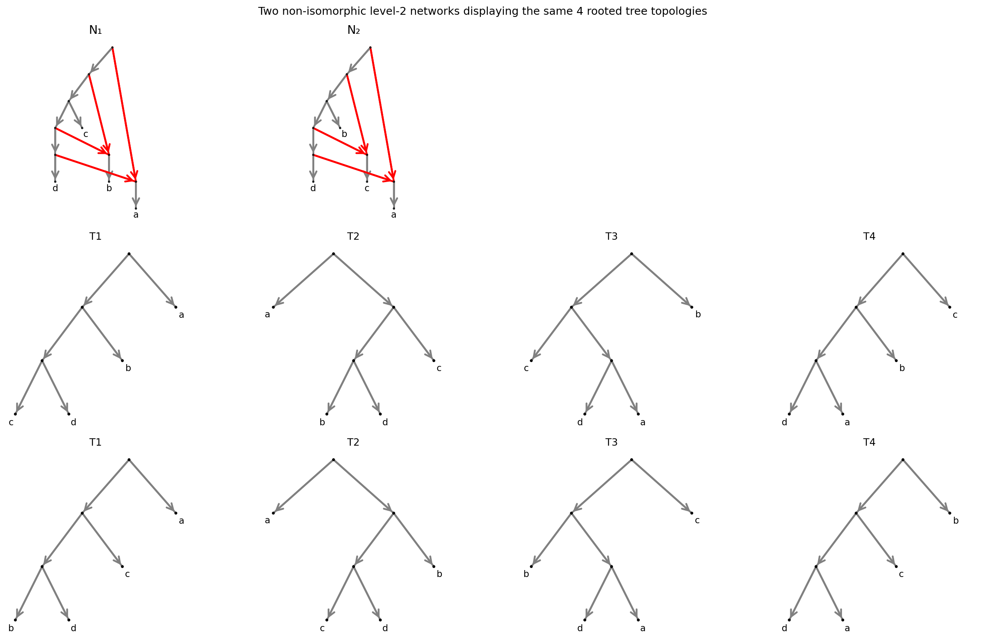

Displayed-Tree Indistinguishable Networks
==========================================

Two phylogenetic networks are *displayed-tree indistinguishable* if they display
exactly the same set of rooted tree topologies, yet are not isomorphic as networks.
This means that inference methods based on displayed trees (under a model without ILS) cannot tell them apart — they are genuinely
different networks that look identical from the perspective of their embedded trees.

This tutorial searches exhaustively for such a pair. To find a structurally interesting example, we restrict to:

* **Level-2 networks on four taxa** — the smallest setting where non-trivial
  indistinguishable pairs can occur.
* **No triangles (3-cycles)** — a node whose two successors are also directly
  connected generates indistinguishable pairs in a predictable, degenerate way.
* **No parallel edges** — multiple edges between the same pair of nodes lead to
  trivial indistinguishability by the same argument.

The search checks roughly 1300 candidate networks.
For every candidate we must enumerate its displayed trees and compare them
up to isomorphism against all previously seen tree-sets.

Setup
------

.. code-block:: python

   from itertools import permutations, product

   from phylozoo.core.network.dnetwork.classifications import has_parallel_edges
   from phylozoo.core.network.dnetwork.derivations import displayed_trees
   from phylozoo.core.network.dnetwork.generator.attachment import attach_leaves_to_generator
   from phylozoo.core.network.dnetwork.generator.construction import all_level_k_generators
   from phylozoo.core.network.dnetwork.isomorphism import is_isomorphic

   TAXA = ["a", "b", "c", "d"]

Helper functions
-----------------

**Enumerate all leaf attachments for a generator.**
Each taxon is assigned to a hybrid side or an edge side of the generator skeleton.
The assignment is exhaustive: all permutations for hybrid sides, all distributions
for edge sides.

.. code-block:: python

   def all_leaf_attachments(gen, taxa):
       hs = gen.hybrid_sides   # sides that must receive exactly one leaf (hybrid nodes)
       es = gen.edge_sides     # sides that can receive one or more leaves
       for ha in permutations(taxa, len(hs)):
           rem = [t for t in taxa if t not in ha]   # taxa not yet placed
           for bi in product(range(len(es)), repeat=len(rem)):
               # bi assigns each remaining taxon to one of the edge sides
               bins = [[] for _ in es]
               for t, i in zip(rem, bi):
                   bins[i].append(t)
               st = {s: [h] for s, h in zip(hs, ha)}
               for s, tl in zip(es, bins):
                   if tl:
                       st[s] = tl
               try:
                   net = attach_leaves_to_generator(gen, st)
                   if set(net.taxa) == set(taxa):   # skip degenerate attachments
                       yield net
               except Exception:
                   pass

**Compute the set of distinct displayed-tree topologies.**
``make_lsa=True`` removes any degenerate unary root that arises when a switching
prunes one entire side of the root node.

.. code-block:: python

   def unique_displayed_trees(net):
       unique = []
       for t in displayed_trees(net, make_lsa=True):
           if not any(is_isomorphic(t, u) for u in unique):
               unique.append(t)
       return unique

**Check whether two tree-sets are equal up to isomorphism.**

.. code-block:: python

   def same_tree_sets(trees1, trees2):
       if len(trees1) != len(trees2):
           return False
       matched = [False] * len(trees2)
       for t1 in trees1:
           found = False
           for j, t2 in enumerate(trees2):
               if not matched[j] and is_isomorphic(t1, t2):
                   matched[j] = True
                   found = True
                   break
           if not found:
               return False
       return True

**Detect a triangle (3-cycle): a node whose two successors are also directly connected.**

.. code-block:: python

   def has_triangle(net):
       G = net._graph
       for u in G.nodes:
           succs = list(G.successors(u))
           for i in range(len(succs)):
               for j in range(i + 1, len(succs)):
                   s1, s2 = succs[i], succs[j]
                   if G.has_edge(s1, s2) or G.has_edge(s2, s1):
                       return True
       return False

For parallel edges we use the built-in PhyloZoo predicate imported above.

The search
-----------

Networks are grouped by their displayed-tree set. The loop stops as soon as it
finds two non-isomorphic networks in the same group:

.. code-block:: python

   generators = list(all_level_k_generators(2))   # 4 generators for level-2
   groups = []    # each entry: (representative tree-set, [networks with that tree-set])
   found = None

   for gen in generators:
       for net in all_leaf_attachments(gen, TAXA):

           # Skip trivial cases
           if has_triangle(net) or has_parallel_edges(net):
               continue

           # Compute the multiset of displayed-tree topologies for this network
           trees = unique_displayed_trees(net)

           # Try to place this network in an existing group
           for rep_trees, group_nets in groups:
               if same_tree_sets(trees, rep_trees):
                   # Same tree-set found — check for non-isomorphism
                   if not any(is_isomorphic(net, m) for m in group_nets):
                       found = (group_nets[0], net, rep_trees)
                   group_nets.append(net)
                   break
           else:
               # First network with this tree-set: start a new group
               groups.append((trees, [net]))

           if found:
               break
       if found:
           break

   n1, n2, shared_trees = found

The bottleneck is ``same_tree_sets``: it runs a pairwise isomorphism check
between every displayed tree of the candidate and every representative tree
already stored. With up to four displayed trees per network and hundreds of
groups, this adds up quickly.

Result
-------

The first displayed-tree indistinguishable pair found shares **four** rooted tree
topologies. The two networks are non-isomorphic — they differ in the placement
of one hybrid edge — yet every displayed tree of N₁ is isomorphic to exactly one
displayed tree of N₂, and vice versa.

   **Top row:** the two networks N₁ and N₂.
   **Middle row:** the four displayed trees of N₁.
   **Bottom row:** the four displayed trees of N₂.
   Each tree in row 2 is isomorphic to exactly one tree in row 3.

See Also
--------

- :doc:`Plotting manual <../manual/visualization/plotting>` — plotting and layout options
- :doc:`Tutorial: Plotting Networks <visualization>` — visualization example
