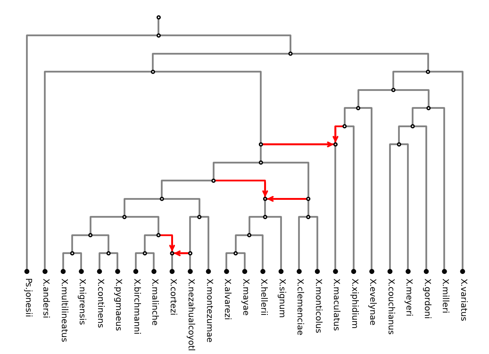
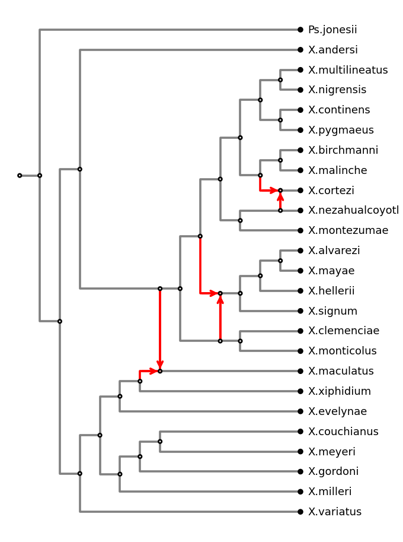
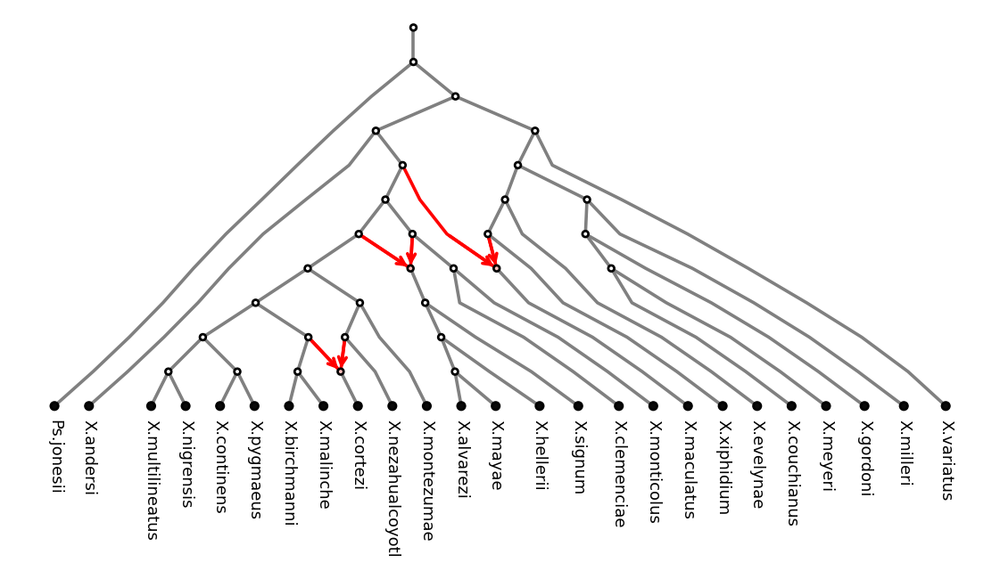
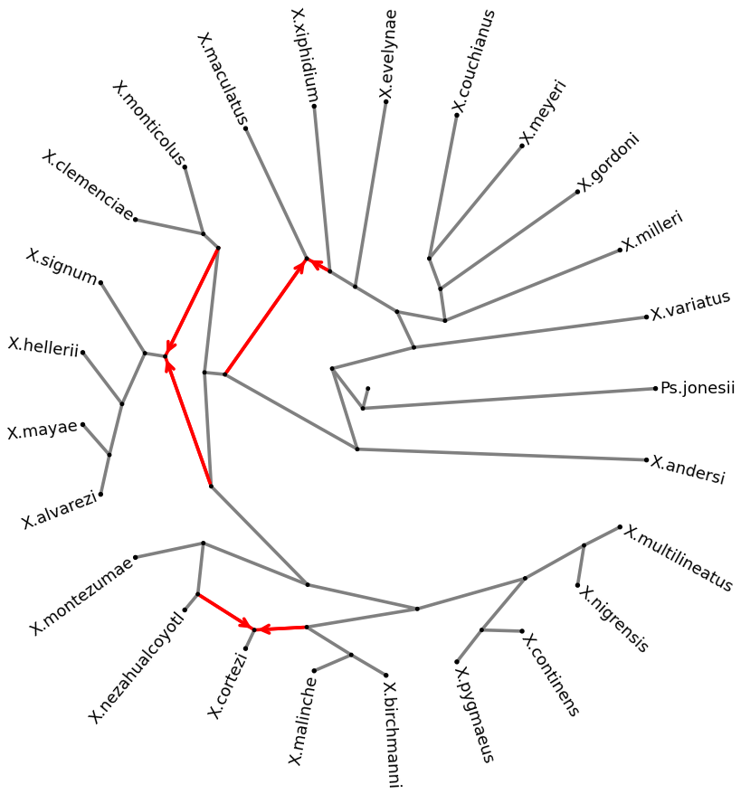
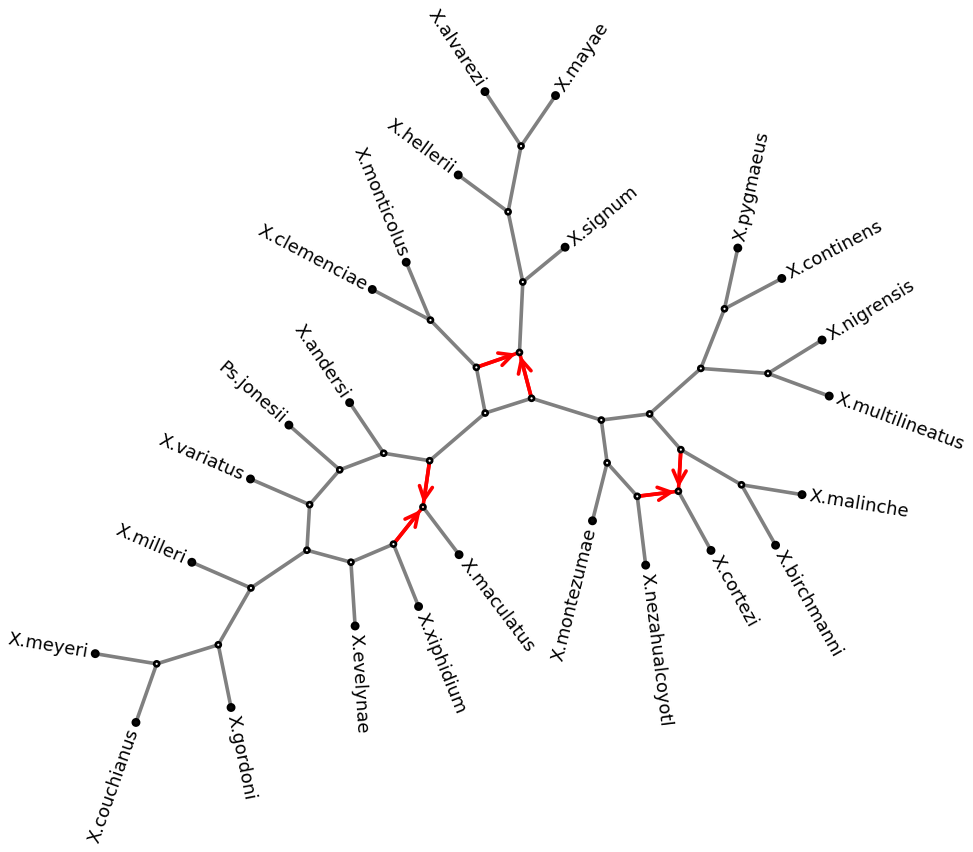
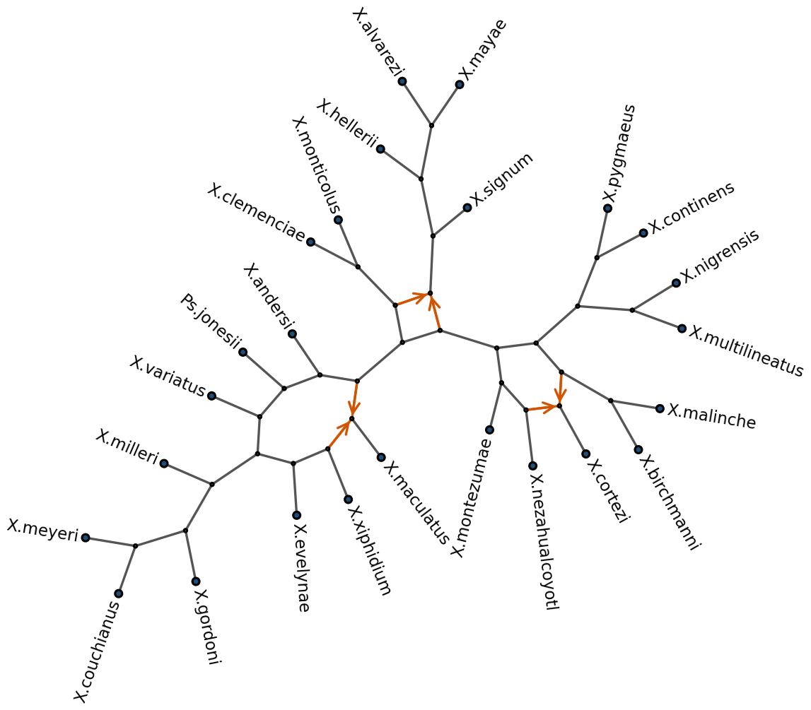

Plotting Networks
=================

This tutorial walks through plotting phylogenetic networks step by step, using the
*Xiphophorus* swordfish reticulate phylogeny from :cite:`Holtgrefe2025Squirrel` as a running
example: loading the rooted network, previewing it in the terminal, plotting it with the
PhyloZoo layouts, converting it to a semi-directed network and plotting that, and finally
styling and saving a publication-ready figure.

Prerequisites: ``phylozoo[viz]`` installed (``pip install phylozoo[viz]``).

Loading the Network
-------------------

The network is given as an eNewick string; loading it as a
:class:`~phylozoo.core.network.dnetwork.base.DirectedPhyNetwork` keeps the root of the string:

.. code-block:: python

   from phylozoo import DirectedPhyNetwork

   NEWICK = (
       "((Ps.jonesii,((((X.evelynae,(X.xiphidium,(X.maculatus)#H1)),"
       "(((X.meyeri,X.couchianus),X.gordoni),X.milleri)),X.variatus),"
       "((#H1,((((((X.multilineatus,X.nigrensis),(X.pygmaeus,X.continens)),"
       "((X.malinche,X.birchmanni),(X.cortezi)#H2)),(X.montezumae,"
       "(#H2,X.nezahualcoyotl))),((X.signum,(X.hellerii,(X.mayae,"
       "X.alvarezi))))#H3),(#H3,(X.clemenciae,X.monticolus)))),X.andersi))));"
   )

   dnet = DirectedPhyNetwork.from_string(NEWICK, format="enewick")
   print(dnet.number_of_nodes(), "nodes,", len(dnet.taxa), "taxa,", len(dnet.hybrid_nodes), "hybrid nodes")
   # 56 nodes, 25 taxa, 3 hybrid nodes

Taxon names containing spaces must be replaced with underscores or dots (the parser does not
accept quoted names). Back-references like ``#H1`` link the two incoming edges of a hybrid node.

Previewing in the Terminal
--------------------------

Before plotting anything, :meth:`~phylozoo.core.network.dnetwork.base.DirectedPhyNetwork.preview`
draws the network as text, root on the left and leaves on the right. It needs no matplotlib:

.. code-block:: python

   dnet.preview()

.. code-block:: text

         ┌─────────────────────────────────────────────────────────────────────────────● Ps.jonesii
         │
         │           ┌─────────────────────────────────────────────────────────────────● X.andersi
         │           │
         │           │                                                           ┌─────● X.multilineatus
         │           │                                                     ┌─────●
         │           │                                                     │     └─────● X.nigrensis
         │           │                                               ┌─────●
         │           │                                               │     │     ┌─────● X.continens
         │           │                                               │     └─────●
         │           │                                               │           └─────● X.pygmaeus
         │           │                                         ┌─────●
         │           │                                         │     │           ┌─────● X.birchmanni
         │           │                                         │     │     ┌─────●
         │     ┌─────●                                         │     │     │     └─────● X.malinche
   ○─────●     │     │                                   ┌─────●     └─────●
         │     │     │                                   │     │           └┄┄┄┄>◆─────● X.cortezi
         │     │     │                                   │     │                 ^
         │     │     │                                   │     │     ┌───────────●─────● X.nezahualcoyotl
         │     │     │                                   │     └─────●
         │     │     │                                   │           └─────────────────● X.montezumae
         │     │     │                             ┌─────●
         │     │     │                             │     ┊                       ┌─────● X.alvarezi
         │     │     │                             │     ┊                 ┌─────●
         │     │     │                             │     ┊           ┌─────●     └─────● X.mayae
         │     │     │                             │     ┊           │     │
         │     │     └───────────────────────●─────●     └┄┄┄┄>◆─────●     └───────────● X.hellerii
         │     │                             ┊     │           ^     │
         │     │                             ┊     │           ┊     └─────────────────● X.signum
         └─────●                             ┊     │           ┊
               │                             ┊     │           ┊     ┌─────────────────● X.clemenciae
               │                             ┊     └───────────●─────●
               │                             ┊                       └─────────────────● X.monticolus
               │                             v
               │                       ┌┄┄┄┄>◆─────────────────────────────────────────● X.maculatus
               │                 ┌─────●
               │           ┌─────●     └───────────────────────────────────────────────● X.xiphidium
               │           │     │
               │           │     └─────────────────────────────────────────────────────● X.evelynae
               │           │
               │     ┌─────●                 ┌─────────────────────────────────────────● X.couchianus
               │     │     │           ┌─────●
               │     │     │     ┌─────●     └─────────────────────────────────────────● X.meyeri
               │     │     │     │     │
               └─────●     └─────●     └───────────────────────────────────────────────● X.gordoni
                     │           │
                     │           └─────────────────────────────────────────────────────● X.milleri
                     │
                     └─────────────────────────────────────────────────────────────────● X.variatus

Solid lines are tree edges, dotted lines with an arrowhead are hybrid edges, ``◆`` is a hybrid
node and ``○`` the root.

Plotting a Directed Network
---------------------------

All plotting goes through :func:`~phylozoo.viz.plot`, which picks a default layout per network
class; pass ``layout=`` to choose another one and layout options as keyword arguments. In every
drawing hybrid nodes are pink and hybrid edges red with an arrowhead at the hybrid node.

pz-cladogram
^^^^^^^^^^^^

The default layout for directed networks is a rectangular layered drawing with the root at the
top and the leaves aligned at the bottom. Every node hangs below one of its parents, sibling
subtrees stay together, and where the network allows it the parent of a hybrid edge is lowered
onto the hybrid's layer so the edge is horizontal. Only hybrid edges carry an arrowhead, since
the direction is implied by the drawing.

.. code-block:: python

   from phylozoo.viz import plot

   ax = plot(dnet)

   ``plot(dnet)``: the default ``pz-cladogram`` layout.

``direction="LR"`` puts the root on the left and the leaves in a column on the right, with
horizontal labels, which suits long taxon names (``rectangular=False`` gives straight edges in
either direction):

.. code-block:: python

   ax = plot(dnet, direction="LR")

   ``pz-cladogram`` with ``direction="LR"``.

pz-layered
^^^^^^^^^^

A layered layout in the style of Graphviz ``dot``: nodes of a layer are ordered freely (no tree
backbone), which gives fewer crossings on heavily reticulate networks at the cost of sibling
subtrees not staying together. Leaves keep their own depth by default; ``align_leaves=True``
puts them on the bottom row:

.. code-block:: python

   ax = plot(dnet, layout="pz-layered", align_leaves=True)

   ``pz-layered`` with ``align_leaves=True``.

pz-radial
^^^^^^^^^

A circular cladogram: root at the centre, leaves evenly spaced on the outer circle, hybrid
edges as chords:

.. code-block:: python

   ax = plot(dnet, layout="pz-radial")

   ``pz-radial``.

The unrooted ``pz-unrooted`` layout of the next section can be used for directed networks as
well; the root is then an ordinary node, marked in gold. All layouts are deterministic; their
options and the generic NetworkX and Graphviz layouts are listed in the
:doc:`plotting manual <../manual/visualization/plotting>`.

Plotting a Semi-Directed Network
--------------------------------

Converting to a Semi-Directed Network
^^^^^^^^^^^^^^^^^^^^^^^^^^^^^^^^^^^^^

A :class:`~phylozoo.core.network.sdnetwork.sd_phynetwork.SemiDirectedPhyNetwork` forgets the
root: the hybrid edges keep their direction, every other edge becomes undirected. Convert the
rooted network with
:func:`~phylozoo.core.network.dnetwork.derivations.to_sd_network` (an eNewick string can also be
loaded as a semi-directed network directly with ``SemiDirectedPhyNetwork.from_string``):

.. code-block:: python

   from phylozoo.core.network.dnetwork.derivations import to_sd_network

   sd = to_sd_network(dnet)
   print(sd.number_of_nodes(), "nodes,", len(sd.taxa), "taxa,", len(sd.hybrid_nodes), "hybrid nodes")
   # 54 nodes, 25 taxa, 3 hybrid nodes

The two nodes fewer are the root and its now-suppressed neighbour.

pz-unrooted
^^^^^^^^^^^

The default layout for semi-directed networks draws the tree of blobs first and each blob
(the reticulate parts of the network) as a polygon in the space reserved for it, so cut edges
never cross blob edges; a short relaxation then spreads the drawing. Leaf labels read outwards
along their pendant edge.

.. code-block:: python

   ax = plot(sd)

   ``plot(sd)``: the default ``pz-unrooted`` layout.

``pz-radial`` is available for semi-directed networks too (the network is rooted first,
``root_location`` chooses where), and ``sd.preview()`` works like the directed one.

Customising the Style
---------------------

Pass a style object to control colours, node sizes and label placement:
:class:`~phylozoo.viz.sdnetwork.style.SDNetStyle` for semi-directed networks,
:class:`~phylozoo.viz.dnetwork.style.DNetStyle` for directed ones (same attributes, plus
``arrows`` and the root options):

.. code-block:: python

   from phylozoo.viz.sdnetwork.style import SDNetStyle

   style = SDNetStyle(
       node_size=60,               # internal node size
       leaf_size=140,              # leaf node size (overrides node_size for leaves)
       node_color="#dddddd",       # internal node fill
       leaf_color="#1f4e79",       # leaf fill
       hybrid_color="#f5b041",     # hybrid node fill
       edge_color="#555555",       # tree edges
       hybrid_edge_color="#d35400",  # hybrid edges
       edge_width=1.6,
       label_offset=0.012,         # distance from node centre to label
       label_font_size=11,
   )
   ax = plot(sd, style=style)

   Semi-directed phylogenetic network of 25 *Xiphophorus* species with three
   hybridisation events (H1–H3) :cite:`Holtgrefe2025Squirrel`, with the style above.

Key style attributes:

* ``node_size`` / ``leaf_size`` — size of node circles (arbitrary units; 100 ≈ small dot).
* ``node_color`` / ``leaf_color`` / ``hybrid_color`` — any matplotlib colour string.
* ``edge_color`` / ``hybrid_edge_color`` / ``edge_width`` — edge colours (defaults ``"gray"`` and ``"red"``) and width.
* ``label_offset`` — label distance from node centre in layout coordinates.
* ``label_font_size`` — matplotlib font size.
* ``label_rotation`` — ``None`` (default) aligns each label with its edge; a fixed angle such
  as ``0`` keeps all labels horizontal, placed beside the node on its outward side.
* ``arrows`` (directed only) — ``'all'``, ``'hybrid'`` or ``'none'``; ``None`` (default) draws
  arrowheads on hybrid edges only in the layered and radial layouts and on all edges otherwise.

Saving to File
--------------

To save the figure above, pass an existing axes to embed the plot in a figure, then save:

.. code-block:: python

   import matplotlib.pyplot as plt

   fig, ax = plt.subplots(figsize=(10, 7))
   plot(sd, ax=ax, style=style)
   fig.savefig("xiphophorus.png", dpi=150, bbox_inches="tight", pad_inches=0.05)

Use ``bbox_inches="tight"`` to crop whitespace and ``pad_inches`` to control the remaining
margin. For a publication-quality PDF, replace ``.png`` with ``.pdf``.

See Also
--------

- :doc:`Plotting manual <../manual/visualization/plotting>` — Full reference for layouts and parameters
- :doc:`Styling manual <../manual/visualization/styling>` — All style attributes explained
