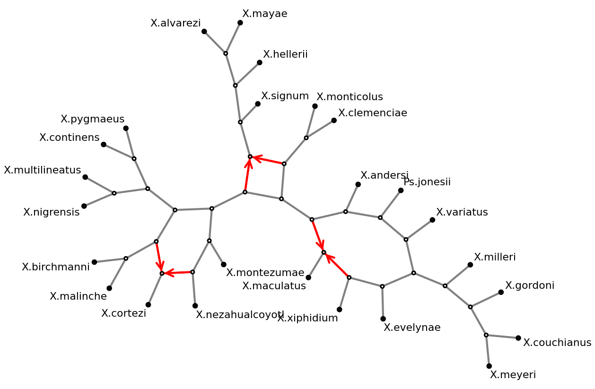

Plotting a Semi-Directed Network
=================================

This tutorial walks through plotting a semi-directed phylogenetic network step by step,
using a published *Xiphophorus* fish reticulate phylogeny as a running example.
It covers loading a network from eNewick, choosing a layout, customising the style, and
saving a publication-ready figure.

Prerequisites: ``phylozoo[viz]`` installed (``pip install phylozoo[viz]``) and Graphviz
available (``pip install phylozoo[graphviz]``).

.. seealso::

   :doc:`Plotting manual <../manual/visualization/plotting>` — Full reference for layouts and parameters.
   :doc:`Styling manual <../manual/visualization/styling>` — All style attributes explained.

Loading the Network
-------------------

Semi-directed networks can be loaded from an eNewick string directly:

.. code-block:: python

   from phylozoo.core.network.sdnetwork import SemiDirectedPhyNetwork

   NEWICK = (
       "((Ps.jonesii,((((X.evelynae,(X.xiphidium,(X.maculatus)#H1)),"
       "(((X.meyeri,X.couchianus),X.gordoni),X.milleri)),X.variatus),"
       "((#H1,((((((X.multilineatus,X.nigrensis),(X.pygmaeus,X.continens)),"
       "((X.malinche,X.birchmanni),(X.cortezi)#H2)),(X.montezumae,"
       "(#H2,X.nezahualcoyotl))),((X.signum,(X.hellerii,(X.mayae,"
       "X.alvarezi))))#H3),(#H3,(X.clemenciae,X.monticolus)))),X.andersi))));"
   )

   net = SemiDirectedPhyNetwork.from_string(NEWICK, format="enewick")
   print(net.number_of_nodes(), "nodes,", len(net.taxa), "taxa,", len(net.hybrid_nodes), "hybrid nodes")

Taxon names containing spaces must be replaced with underscores or dots (the parser
does not accept quoted names). Back-references like ``#H1`` link the two incoming edges
of a hybrid node.

Basic Plot
----------

The simplest call uses all defaults:

.. code-block:: python

   from phylozoo.viz import plot

   ax = plot(net)

The default layout for :class:`~phylozoo.core.network.sdnetwork.sd_phynetwork.SemiDirectedPhyNetwork`
is ``'neato'`` (Graphviz spring-embedder).

Hybrid edges are drawn in red with arrowheads pointing from parent to hybrid node.
Undirected tree edges are drawn in gray.

Choosing a Layout
-----------------

Pass any supported layout name to override the default:

.. code-block:: python

   ax = plot(net, layout="fdp")       # force-directed, good for large networks
   ax = plot(net, layout="twopi")     # radial, root at centre
   ax = plot(net, layout="circo")     # all nodes on a circle
   ax = plot(net, layout="spring")    # NetworkX Fruchterman-Reingold (no Graphviz needed)

Graphviz layouts accept extra attributes via the ``args`` keyword, which is forwarded
directly to the Graphviz program as graph attributes:

.. code-block:: python

   # Deterministic neato layout (initial positions from graph topology)
   ax = plot(net, layout="neato", args="-Gstart=self")

   # Wider ring spacing in twopi
   ax = plot(net, layout="twopi", args="-Granksep=2.0")

Customising the Style
---------------------

Pass an :class:`~phylozoo.viz.sdnetwork.style.SDNetStyle` instance to control colours,
node sizes, and label placement:

.. code-block:: python

   from phylozoo.viz.sdnetwork.style import SDNetStyle

   style = SDNetStyle(
       node_size=90,           # internal node size
       leaf_size=110,          # leaf node size (overrides node_size for leaves)
       node_color="white",     # internal node fill
       leaf_color="#0a0a0a",   # leaf fill
       hybrid_color="#fcc0bc", # hybrid node fill
       label_offset=0.01,      # distance from node centre to label
       label_font_size=10.5,
   )
   ax = plot(net, layout="neato", style=style, args="-Gstart=self")

Key style attributes:

* ``node_size`` / ``leaf_size`` — size of node circles (arbitrary units; 100 ≈ small dot).
* ``node_color`` / ``leaf_color`` / ``hybrid_color`` — any matplotlib colour string.
* ``hybrid_edge_color`` — colour of hybrid edges (default ``"red"``).
* ``label_offset`` — label distance from node centre in layout coordinates.
* ``label_font_size`` — matplotlib font size.

Labels for leaf nodes are automatically placed on the side facing away from the
connecting edge.

Saving to File
--------------

Pass an existing axes to embed the plot in a figure, then save:

.. code-block:: python

   import matplotlib.pyplot as plt

   fig, ax = plt.subplots(figsize=(10, 7))
   plot(net, ax=ax, layout="neato", style=style, args="-Gstart=self")
   fig.savefig("xiphophorus.png", dpi=150, bbox_inches="tight", pad_inches=0.05)

Use ``bbox_inches="tight"`` to crop whitespace and ``pad_inches`` to control the
remaining margin. For a publication-quality PDF, replace ``.png`` with ``.pdf``.

Result
------

The figure below shows the *Xiphophorus* network with the settings above. Hybrid nodes
are highlighted in pink; three reticulation events (H1–H3) are visible as directed
(red) edges converging on hybrid nodes.

   Semi-directed phylogenetic network of 25 *Xiphophorus* species with three
   hybridisation events (H1–H3).
